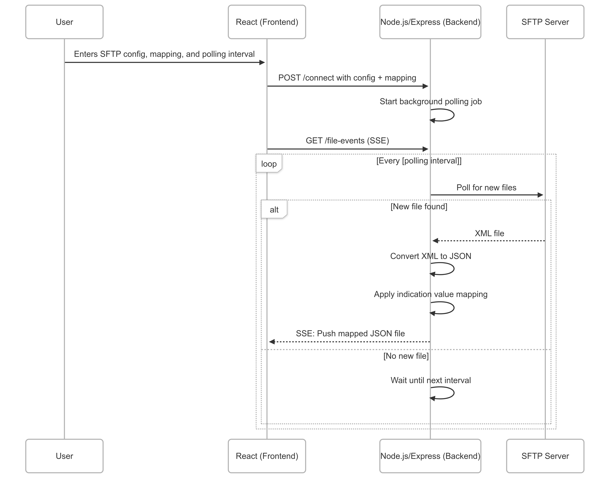

# SFTP Client

A web-based SFTP client which uses polling mechanism to monitor files on an SFTP server. It processes the file contents and sends notifications to connected clients using Server Sent Events.  
The app features a React frontend and a Node.js/Express backend, both runnable in separate processes.

## Project Overview

This app fulfills the following requirements:
- Provides a UI for users to input SFTP configurations.
- Allows configuration of value mappings (e.g., when value A is received in an XML payload, it can be replaced with value B).
- Polls the SFTP folder at intervals based on user-provided configuration.
- Receives XML payloads from the SFTP server, converts them to JSON, and applies the value mappings as specified in the configuration.

## Architecture Diagram



## Prerequisites

- [Node.js](https://nodejs.org/)

## Getting Started

### 1. Clone the repository

```sh
git clone <repo-url>
cd sftp-client
```

### 2. Configure Environment Variables

Edit `.env` as needed and source it before running the app.

### 3. Install Dependencies

Install backend dependencies in the root directory:

```sh
npm install
```

Then install frontend dependencies in the client directory:

```sh
cd client
npm install
cd ..
```

### 4. Run the App

#### Start the Backend Server

```sh
npm run server
```

#### Start the Frontend Client

In a new terminal:

```sh
npm run client
```

By default, they will run at the following URL:
- Frontend: [http://localhost:5173](http://localhost:5173)
- Backend: [http://localhost:3000](http://localhost:3000)
